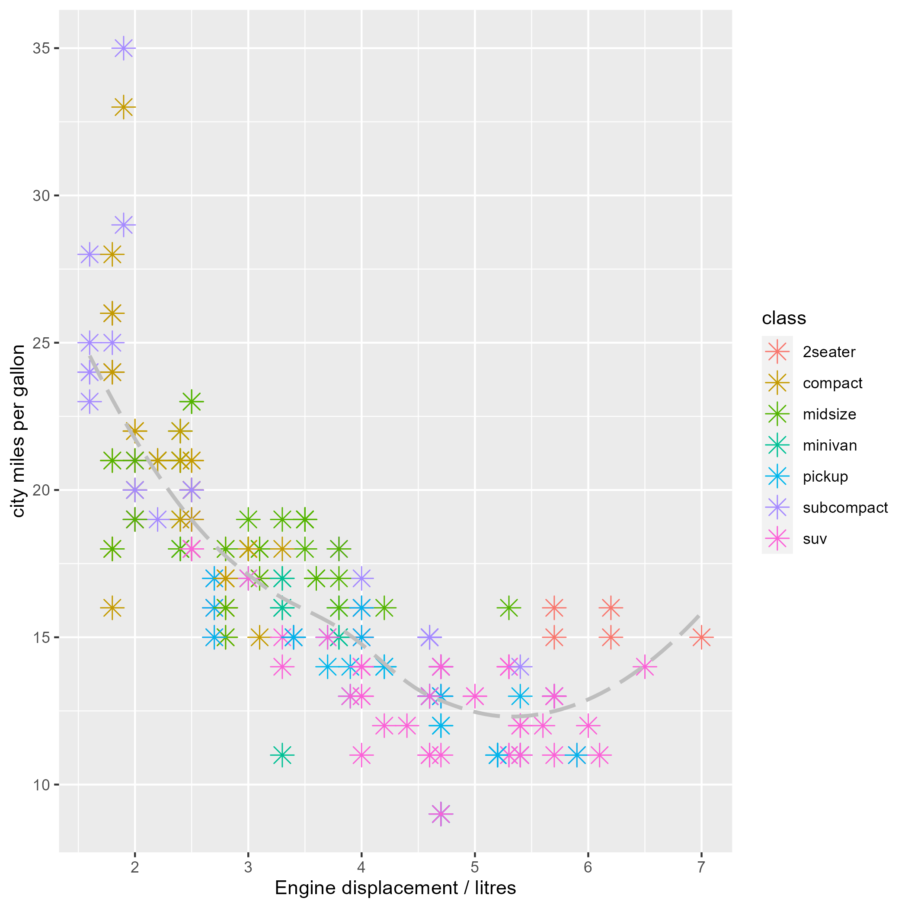
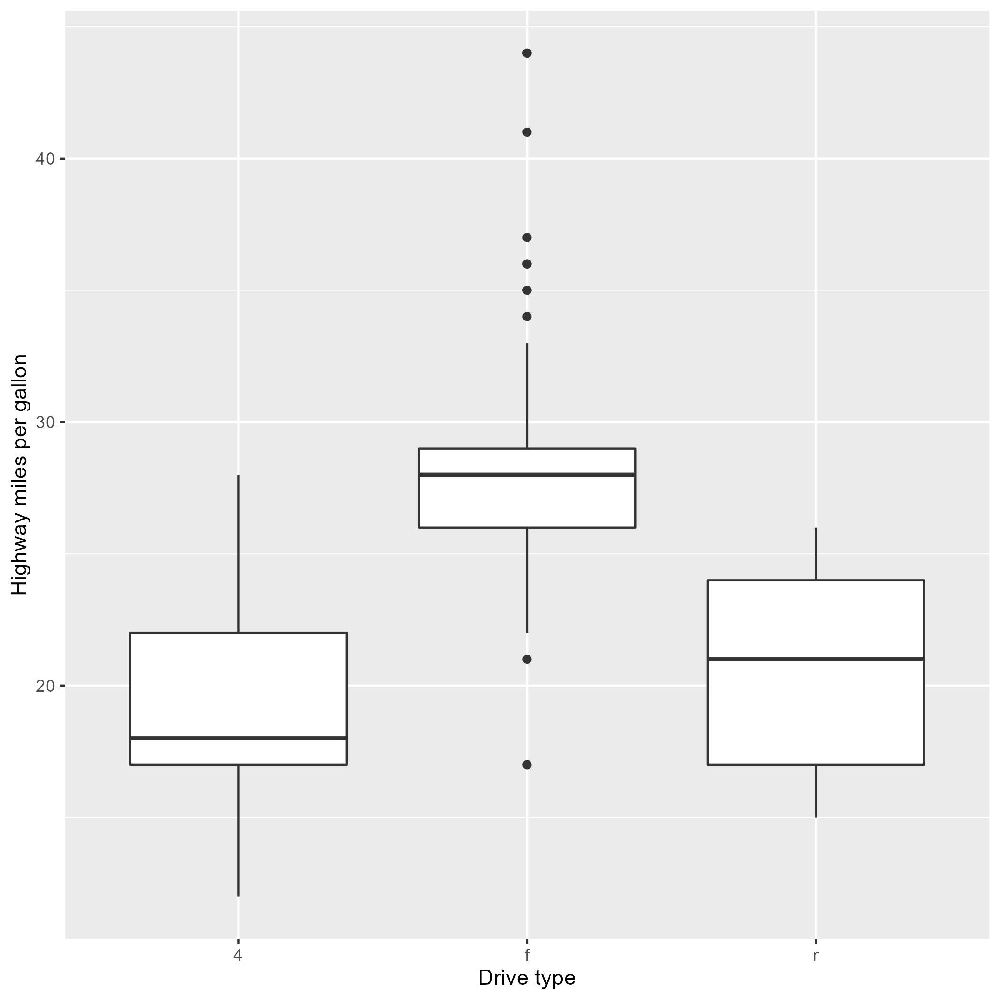
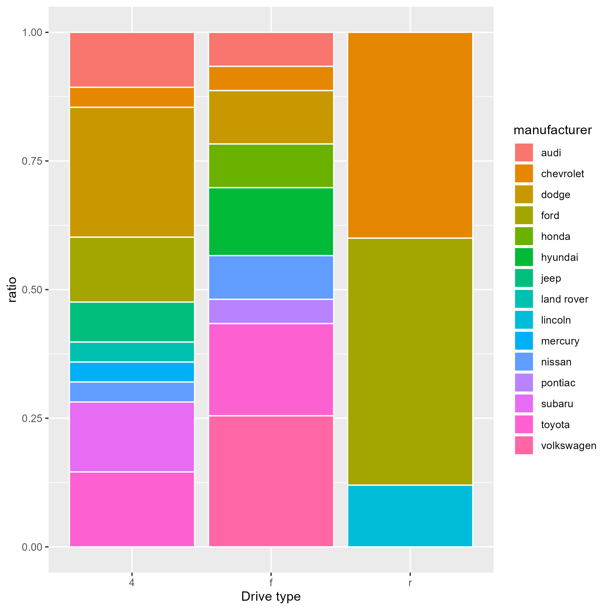

```{r include=FALSE}
library(tidyverse)
library(gridExtra)
library(GGally)
knitr::opts_chunk$set(results = 'hold')
```

## Domaća zadaća {-}


1. Učitajte i proučite podatkovni skup `diamonds` koji dolazi zajedno s paketom `ggplot2`.
```{r}
data(diamonds)
head(diamonds)
```


a) Prikažite raspodjelu cijene dijamanata uz pomoć dva grafa - histograma i tzv. *frekvencijskih poligona* (funkcija `geom_freqpoly`)). Cijene podijelite u 10 ladica. 
```{r}

ggplot(diamonds, aes(x = price)) + geom_histogram(bins = 10)
ggplot(diamonds, aes(x = price)) + geom_freqpoly(bins = 10)

```


b) Grafovima iz a) dodajte "čistoću" dijamanta (stupac `clarity`) koji ćete postaviti na `fill` estetiku (histogram) odnosno `color` estetiku (frekvencijski poligoni). Koju razliku između grafova uočavate obzirom na *default*-ni aspekt pozicije?

```{r}
ggplot(diamonds, aes(x = price, fill = clarity)) + geom_histogram(bins = 10)
ggplot(diamonds, aes(x = price, color = clarity)) + geom_freqpoly(bins = 10,)

```


2. Učitajte i proučite podatkovni skup `mpg`. Pokušajte rekonstruirati sljedeće grafove. Nepoznate geometrije identificirajte uz pomoć podsjetnika.

```{r}
data(mpg)
head(mpg)
```
```{r}
ggplot(mpg, aes(x = displ, y = cty, color = class)) + geom_point(shape = 8, size = 3) + stat_smooth(method = "loess", linetype = 2, se = F, color = "grey") + labs(x = "Engine displacement/litres", y = "city miles per galon")
```

```{r}
ggplot(mpg, aes(x = drv, y = hwy)) + geom_boxplot() + labs(y = "Highway miles per gallon", x = "Drive type")
```


```{r}
ggplot(mpg, aes(x = drv, fill = manufacturer)) + geom_bar(position = "fill") + labs(x = "Drive type") 
```


***



***


***


***

3. Uz pomoć funkcija skaliranja na sljedećem grafu:
   a) os x nazovite `"broj cilindara"`
   b) os y nazovite `"ukupno"` i povećajte raspon do 100
   c) legendu za godine nazovite `"godina"`
   b) za boju pravokutnika odaberite paletu `"Dark2"`

```{r}
ggplot(mpg, aes(x = as.factor(cyl), 
                fill = as.factor(year))) + geom_bar() + scale_x_discrete(name = "broj cilindara") + scale_y_continuous(name = "ukupno",  limits = c(0, 100)) + scale_fill_brewer(name = "godina", palette = "Dark2")
```

4. Promijenite temu sljedećeg grafa na sljedeći način:
     a) prilagodite prikaz projekciji na platno
     b) okrenite nazive na x osi vertikalno


```{r}
ggplot(mpg, aes(x = as.factor(trans), y = displ)) + 
  geom_boxplot() + theme_bw() + theme(axis.text.x = element_text(angle = 90))
```

5. Sljedeći graf prikazuje histogram potrošnje na autocesti pri čemu boja pravokutnika odražava broj cilindara. Pokušajte poboljšati interpretabilnost grafa tako da estetiku boje zamijenite prikazom više grafova uvjetovanih brojem cilindara. Grafove organizirajte u matricu 2 x 2.

```{r}
ggplot(mpg, aes(hwy, fill = as.factor(cyl))) + 
  geom_histogram(bins = 10, position = "dodge") + facet_wrap(~cyl, scales = "free_y", nrow = 2, ncol = 2)
```


6. Pretpostavimo da imamo sljedeći podatkovni okvir:

```{r}
prodaja <- data.frame(mjesec = 1:12,
          ukupno = c(10000, 5000, 12000, 3000, 5000, 7000, 
                   10000, 2000, 4000, 8000, 11000, 14000)) 
ggplot(prodaja, aes(x = as.factor(mjesec), y = ukupno)) + geom_col()
```
  
  i da ga želimo predočiti stupčastim grafom (engl. *bar chart*), no funkcija `geom_bar` po *default*-u radi sa samo jednom varijablom za koju računa sumarne statistike. Kako riješiti ovaj problem? Predložite rješenje i stvorite odgovarajući stupčasti graf.

